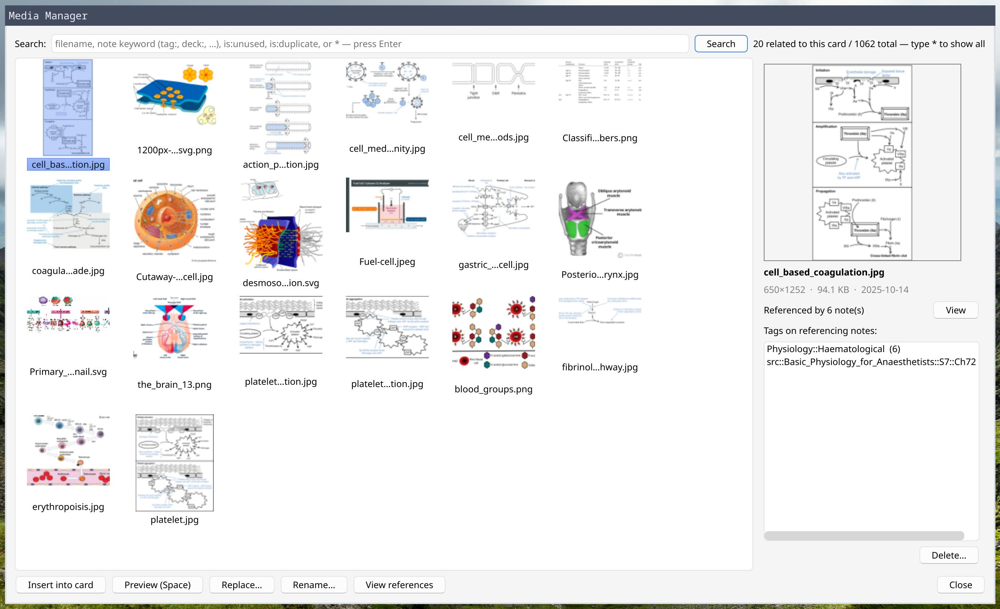
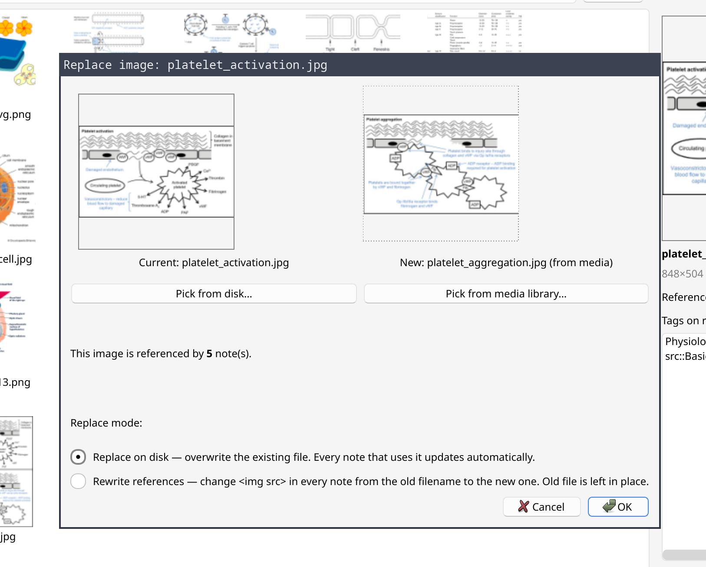

# Anki Media Manager

Reuse and clean up images in your Anki collection. Browse `collection.media`, automatically surface images that belong on the card you're editing, insert with one click, replace an image once to update every card that uses it, and prune the orphans and duplicates that build up over years.

*Suggested screenshot: the main browser opened from an editor, showing the auto-populated related grid on the left and the info panel on the right with an image selected (dimensions, ref count, and a few tags visible).*

## Features

- **Auto-related on open**: launched from a card editor, the grid shows images already on the card, then filename-text matches, then images used on tag-and-text-similar notes.
- **Powerful search**: type a filename substring, an Anki keyword (`hippocampus`), an operator (`tag:anatomy`, `deck:Medicine`), `is:unused`, `is:duplicate`, or `*` for everything. Filename and note-keyword hits merge into one grid.
- **Info panel** (right): preview, dimensions/size/date, "Referenced by N notes" with a one-click jump to Anki's note browser, clickable tags from those notes, and any duplicate files.
- **Preview** an image at full size with mouse-wheel zoom and click-to-pan (Space to open).
- **Insert** at the cursor (double-click or Insert button).
- **Replace** across every card that uses an image, two modes:
  - *Replace on disk* — overwrite the file in place; every reference updates automatically.
  - *Rewrite references* — repoint every `` to a new filename; old file untouched.
- **Rename** a file and update every `` reference across notes.
- **Cleanup**: `is:unused` lists orphans with a bulk-delete button; `is:duplicate` groups same-content files for consolidation via Replace. Deletions go to Anki's media trash (recoverable).

## Install

**AnkiWeb**: search "Media Manager" or install with code *[code TBD on publish]*. Restart Anki.

**Development**: clone the repo, then `just test` copies the addon into `~/.local/share/Anki2/addons21/media-manager-test/` and launches Anki. `just build` packages a release zip.

## Configuration

Tools → Add-ons → Media Manager → Config. Tunable: thumbnail size, similarity-scoring weights (tag / image-neighborhood / text TF-IDF), keyword-search cap, rare-tag fraction. Defaults work for collections up to ~50k notes; first open per session pays a one-off ~1–3s stats build.
